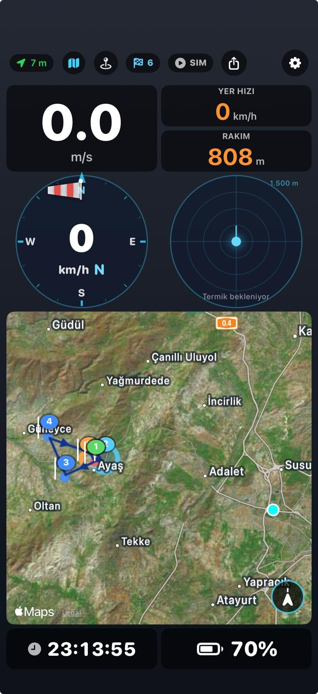

# Vario TB — iOS Paragliding Variometer

Yamaç paraşütü ve planör pilotları için SwiftUI ile yazılmış, **grid tabanlı özelleştirilebilir panel** odaklı variometer uygulaması. Türkçe/İngilizce arayüz, uydu haritası, barometrik vario, rüzgâr hesabı, termik radarı, **FAI üçgen tespiti**, **XCTrack-uyumlu yarışma görevleri (QR ile paylaşım)**, IGC uçuş kaydı, LiveTrack24 canlı takip ve Siri Shortcuts içerir.

**Hedef cihaz:** iPhone 15/16 Pro (iOS 17+) — barometre ve yüksek-hassasiyetli GPS gerekir.

---

## Ekran Görüntüleri

<p align="center">
  
  &nbsp;&nbsp;
  
  &nbsp;&nbsp;
  
  &nbsp;&nbsp;
  
</p>

<p align="center">
  <i>1. Canlı yarışma paneli — simülatörde Ayaş 6-TP görevini uçarken: vario, task-aware HEDEF oku (pilotun uçması gereken yönü relatif olarak gösterir), yer hızı, rakım, sonraki TP'ye 868m, goal'e 14.8km, rüzgâr kadranı, termik radarı, harita üzerinde optimum tangent rotası (mavi çizgi ve oklar), reached TP'ler renkli işaretli.</i><br><br>
  <i>2. Yarışma görevi sayfası — görev mesafesi (22.7 km), 6 turnpoint, QR ile içe/dışa aktarma, başlama/deadline saatleri (UTC), TP listesi (takeoff 400m cylinder ile başlar).</i><br><br>
  <i>3. QR paylaşımı — XCTrack v2 formatında tam uyumlu QR kod. Başka bir Vario TB veya XCTrack cihazı saniyeler içinde görevi yükler.</i><br><br>
  <i>4. Serbest uçuş paneli — task yokken XC ve eğlence uçuşu için daha sade düzen: büyük vario, hız+rakım, wind ve radar yan yana, büyük harita, saat+pil.</i>
</p>

---

## Özellikler

### Grid tabanlı özelleştirilebilir panel

- **4 kolon × N satır** grid. Her kart (vario, rakım, harita, vb.) belirli hücrelere yerleşir, boyutu ve konumu değiştirilebilir.
- **Uzun bas → edit mode** — kartlar titrer, silme/taşıma/boyutlandırma kolları görünür.
- **Sürükle-bırak swap** — bir kartı başka bir kartın üzerine sürüklersen yer değiştirirler (aynı boyutlularsa). Farklı boyutlardaysa iOS home-screen tarzı cascade push.
- **Sağ alt boyut kolu** — kartın genişliğini/yüksekliğini gridte snap-to-cell ile değiştir.
- **Gizli kartlar listesi** — editleme modunda altta kaldırılmış kartlar görünür, tıklayarak geri eklenir.
- **İki hazır default**:
  - **Yarışma layout** — vario + HEDEF (task-aware bearing oku) + yer hızı + rakım + sonraki TP mesafesi + goal mesafesi + wind/radar + harita + saat/pil
  - **Serbest uçuş layout** — vario + yer hızı/rakım + wind/radar + büyük harita + saat/pil (task kartları yok)
- **Edit mode'da sabit footer** — Yarışma / Serbest / Tamam butonları scroll etse bile ekranın altında sabit durur.

### XCTrack-uyumlu yarışma görevleri

- **QR ile içe/dışa aktarma** — XCTrack v2 polyline formatı (bit-perfect uyumlu, `go-xctrack` referansıyla doğrulanmış). `Scan QR Code` tuşu → kamera → Vario TB'ye veya başka XCTrack cihazına saniyeler içinde task yükler.
- **Turnpoint tipleri** — Takeoff, SSS (Start of Speed Section), Turnpoint, ESS (End of Speed Section), Goal. Her TP için silindir yarıçapı, irtifa, ENTRY/EXIT.
- **Görev zamanlaması** — başlama saati (varsayılan 13:00 UTC) ve deadline (varsayılan 16:00 UTC), UI üzerinden set/clear.
- **Optimum tangent rota hesabı** — her silindirin kenarında optimal geçiş noktası 8 iterasyon bisector refinement ile. FlySkyhy/XCTrack scoring ile uyumlu.
- **Canlı reach detection** — pilot bir silindirin içine (radius + 15m GPS tolerance) girdiğinde o TP "reached" olarak işaretlenir. Sıralı — TP2'yi geçmeden TP3 reach edilemez.
- **HEDEF bearing kartı** — ok pilotun o an uçması gereken yönü gösterir (sıradaki TP'ye göre), altında hedef azimut.
- **Mesafe kartları**:
  - **Sonraki TP** — pilotun bir sonraki silindir kenarına olan **optimum rota** mesafesi (silindir içindeyse 0)
  - **Goal** — pilottan goal silindirine kadar **kalan task'ın tamamı** (her TP'nin tangent noktası üzerinden)
  - **Takeoff** — pilotun kalkış noktasına **düz kuş uçuşu** mesafesi
- **Harita üzerinde görsel** — her silindir mavi halka, aralarında navy tangent rota çizgileri 3.5px kalınlıkta, orta noktalarda yön okları. Reached TP'ler farklı tonda işaretli.
- **Task yüklenince auto-fit** — QR tarandığı an harita auto-follow'u kapatıp tüm task'ı çerçeveler (her silindirin 4 cardinal kenar noktası + pilot bounding box'u).
- **Simülatör task-aware** — task yüklüyken SIM butonu aktif. Pilot task'ın takeoff TP'sine ışınlanır, sonra her TP'yi sırayla cylinder içine girerek ziyaret eder, ara TP'lerde 5sn termik simüle eder, goal cylinder'a girince durur.

### Ana uçuş panoları

- **Büyük vario göstergesi** — tırmanışta yeşil, alçalmada kırmızı, sıfır civarında beyaz.
- **Barometrik + GPS fusion** — iOS `CMAltimeter` ile basınç-tabanlı dikey hız, GPS fallback.
- **Yer hızı + rakım** — büyük turuncu rakamlar, monospaced digit.
- **Rüzgâr kadranı (WindDial)** — yatay "windsock" widget'ı, pole rüzgârın GELDİĞİ yönde ring kenarında. 16-nokta kompas (N/NE/ENE/E/...) merkez altında.
- **Termik radarı** — tespit edilen tüm termikleri mesafe+kuvvete göre gösterir. Renk kodlu (aqua-green en güçlüsü, lavender en zayıfı). Menzil 1500m, simülatör termikleri ayrı kategori.
- **Uydu harita kartı** — MapKit Hybrid mode, offline cache. FAI üçgen / task / termikler / pilot marker üzerine overlay.
- **Koordinat pili** — DD / DMS / DM / UTM / MGRS formatları.
- **Saat + Pil kartları** — saniye dahil büyük saat, renk kodlu pil yüzdesi (yeşil ≥50 / sarı ≥20 / kırmızı).

### FAI Üçgen Tespiti (serbest uçuş modu)

- **Canlı üçgen takibi** — kayıt sırasında her 10 saniyede geometrik algoritma çalışır, track history'de **FAI-valid en büyük üçgeni** bulur.
- **FAI kuralları** — min kenar / toplam perimeter ≥ 0.28, kapanış mesafesi / perimeter ≤ 0.20.
- **Harita üzerinde görsel** — 3 turnpoint polygon, kapatma oku ve home target işaretçisi.
- **HUD kartı** — üçgen ikonu + perimeter km + bearing oku + closing mesafesi.
- **Task yüklüyken FAI overlay gizli** — yarışma modunda iki görsel katmanın çakışmaması için.
- **Performans** — point thinning (≥200m aralıklı, max 150 nokta) + n² pre-computed distance matrix + O(n³) brute force. ~50ms hesaplama süresi, arka plan thread.

### Uçuş kaydı & paylaşım

- **IGC formatı** — FAI standardı, B-record + H-record. Dosya: `Documents/Flights/YYYY-MM-DD_HHMMSS[_SIM].igc`. XCSoar / XCTrack / SeeYou / XContest açar.
- **CUP waypoint dosyası** — SeeYou formatı, tespit edilen termikler thermal name + climb rate + timestamp ile. Dosya: `Documents/Waypoints/thermals_....cup`.
- **Otomatik başlatma** — GPS fix + (hız >5 km/h veya climb >1 m/s) → kayıt başlar. Simülatör başlayınca simülatör kaydı (`_SIM`) başlar.
- **Paylaş butonu** — tüm dosyalar listelenir. Her dosya tek tek (iOS share sheet) veya toplu "Hepsini Paylaş". Swipe-to-delete.
- **Pilot/glider bilgisi IGC header'a yazılır** — ad, kanat marka/model, sertifika (EN A/B/C/D, CCC), tip (Paraglider/Hang Glider/Glider/Paramotor).

### LiveTrack24 canlı takip

- **Native session-aware protokol** — `client.php` login → sessionID → `track.php` fixleri. HTTPS first, HTTP fallback.
- **5 saniyede bir pozisyon** — batch upload, XCTrack'e benzer veri tüketimi.
- **Keychain şifre** — kullanıcı adı AppStorage, şifre iOS Keychain.
- **Session ID formülü** — XCTrack ile bire-bir: `(random & 0x7F000000) | (userID & 0x00FFFFFF) | 0x80000000`.

### Waypoint kütüphanesi

- **JSON persist** — `Documents/waypoint_library.json`.
- **Manuel giriş** — name + koordinat + opsiyonel irtifa.
- **CUP import/export** — SeeYou formatında içe/dışa aktarma.
- **Task editörden seçim** — kütüphaneden turnpoint'e doğrudan eklenebilir.

### Siri Shortcuts (App Intents, iOS 16+)

- 6 ses komutu: kayıt başlat/durdur, live tracking başlat/durdur, irtifa söyle, dikey hız söyle.
- Shortcuts app entegrasyonu, Home Screen'e eklenebilir.
- iPhone 15/16 Pro **Action Button**'a bağlanabilir.
- Türkçe + İngilizce.

### Ses motoru

- **Procedural DSP** — AVAudioSourceNode ile 4-harmonik buzzer. Base 500Hz → max 1600Hz pitch scaling. 2.5→8 Hz arası cadence.
- **Bluetooth otomatik routing** — AVAudioSession Bluetooth-A2DP.
- **Ses test** — ayarlar ekranında 0→5 m/s rampa.

### Dil desteği

- **Türkçe (varsayılan) + İngilizce** — ayarlarda segmented picker.
- **Singleton + `@Published`** — dil değiştiğinde tüm ekranlar anında re-render.

---

## Kurulum

```bash
git clone <bu-repo>
cd VarioTB
open VarioTB.xcodeproj
```

1. Xcode 15+ aç.
2. Target → Signing & Capabilities → **kendi Apple Developer Team'ini seç**. Bundle ID: `com.tbiliyor.VarioTB`.
3. iPhone bağla → Run (⌘R).

**Gerçek uçuş testi için fiziksel cihaz gerekir** — iOS simülatöründe GPS, barometre ve MapKit 3D desteği yok.

---

## Dosya yapısı

```
.
├── README.md
├── docs/screenshots/              README ekran görüntüleri
└── VarioTB/
    ├── VarioTBApp.swift               App entry + audio session setup
    ├── Info.plist                     İzinler, background modes, ATS exception
    ├── Assets.xcassets/               App icon
    ├── Models/
    │   ├── AppSettings.swift          @AppStorage ayarlar + pilot/glider
    │   ├── PanelLayout.swift          Grid layout + card kinds + swap/placing
    │   ├── CompetitionTask.swift      Task + turnpoint + optimal tangent + reach
    │   ├── ThermalPoint.swift         ThermalPoint + ThermalSource(.real/.simulated)
    │   ├── WaypointLibrary.swift      JSON waypoint persistence
    │   └── L10n.swift                 TR/EN çeviri + LanguagePreference singleton
    ├── Intents/
    │   └── VarioTBIntents.swift       Siri App Intents + AppShortcutsProvider
    ├── Managers/
    │   ├── LocationManager.swift      GPS + CMAltimeter + simulator injection
    │   ├── VarioManager.swift         Vario filter + termik tespit (6s streak)
    │   ├── WindEstimator.swift        Circling-based rüzgâr (course spread >90°)
    │   ├── FlightSimulator.swift      Task-aware simulator (cylinder entry, thermals)
    │   ├── FAITriangleDetector.swift  O(n³) FAI triangle search, flight-start tracking
    │   ├── IGCRecorder.swift          FAI IGC B-record / H-record yazar
    │   ├── WaypointExporter.swift     SeeYou CUP formatı
    │   ├── FlightRecorder.swift       IGC + waypoint koordinatör + otomatik start/stop
    │   ├── KeychainStore.swift        Keychain wrapper (LiveTrack24 şifresi)
    │   └── LiveTrack24Tracker.swift   Session-aware LT24 protocol client
    ├── Audio/
    │   └── AudioEngine.swift          AVAudioSourceNode DSP (4 harmonik, cadence)
    ├── Utils/
    │   ├── CoordConverter.swift       DMS/DM/UTM/MGRS dönüşümleri
    │   └── TaskQRCodec.swift          XCTrack v1/v2/XCTSKZ polyline codec
    └── Views/
        ├── ContentView.swift          ZStack + panel grid + task fit observer
        ├── PanelView.swift            Grid renderer + drag/resize + edit footer
        ├── TopBar.swift               GPS pill + SIM + waypoints + task + share + settings
        ├── SatelliteMapView.swift     MapKit + task overlay + FAI + recenter
        ├── WindDial.swift             Yatay windsock + tick + N/E/S/W
        ├── ThermalRadar.swift         Tüm termiklerin radar ekranı
        ├── CompetitionTaskView.swift  Task editörü + QR scan/share + timing
        ├── WaypointsView.swift        Waypoint kütüphanesi CRUD
        ├── TurnpointEditor.swift      Tek TP edit sayfası
        ├── TaskQRCaptureView.swift    Kamera QR tarayıcı
        ├── SettingsView.swift         Form — tamamen L10n üzerinden
        ├── FilesListView.swift        IGC/CUP listesi + paylaş/sil
        └── ShareSheet.swift           UIActivityViewController wrapper
```

---

## Önemli teknik notlar

**Grid layout collision & swap.** Kartlar `[col..<col+width] × [row..<row+height]` dikdörtgenleri. Drag end'de drop hedefi başka bir kart tarafından işgal ediliyorsa **swap** dener (aynı boyutlularsa); değilse **placing** ile hedef konuma yerleştirir ve çakışanları aşağı iter (iOS home-screen cascade). PanelLayout değişimi `@AppStorage` JSON ile persiste edilir.

**XCTrack polyline codec.** Google polyline algoritması (5 decimal precision, zig-zag encoding). XCTrack v2 formatında: `XCTSKZ:<base64>` → gzip decompressed → polyline koordinat listesi + turnpoint tipleri + radii + başlama/deadline saati. `Utils/TaskQRCodec.swift` Ankara koordinatlarıyla bit-perfect go-xctrack reference ile doğrulandı.

**Optimum tangent route.** Silindir ağı için en kısa pilot-goal yolu: pilot anchor, her ara TP cylinder edge'inde tangent noktası, goal cylinder center (pilot goal'e girmek zorunda). 8 iterasyon bisector refinement: her iterasyonda her ara TP için önceki + sonraki path noktalarına bakıp açıortayı hesapla, silindir kenarına projekt et. 6 TP'lik Ayaş task'ında center-to-center 22.7 km → optimum 18.7 km (17.6% daha kısa).

**Reach detection.** `updateProgress(pilot:)` her GPS update'te çağrılır. Pilot `radius + 15m` içindeyse reach, sıralı — bir TP reach edilmeden sonrakine geçilemez. Tangent pass (içeri girmeden geçme) reach saymaz — gerçek yarışma kuralı.

**Harita task overlay cache.** SatelliteMapView coordinator'da `lastTaskSignature` (TP id+coord+radius concat). updateUIView her GPS update'te tetiklenir (~10Hz) ama **sadece signature değiştiğinde** cylinder/route overlay'leri yeniden build edilir. Aksi halde sim sırasında overlay'ler flicker eder.

**Task-aware simulator.** `FlightSimulator.loadTask(waypoints:)` ile turnpoint listesi yüklenir. `start()` pilot'u ilk TP'nin koordinatına ışınlar, sonra her TP için `.taskLeg` fazında önce optimum tangent noktasına uçar, tangent noktasından 80m yaklaşınca cylinder merkezine deflekte olur, `radius - 5m` içine girince reach, interior TP'lerse 5sn 3.8 m/s termal (`.taskClimb`), sonra sonrakine geçer. Goal cylinder içine girince durur. `timeScale = 18×` — 19 km task ~2 dakika real time.

**Vario filter.** `damperLevel` sabit 1 (bypass). iOS barometre verisi zaten düşük-gürültülü; ek damper gecikme ekliyordu. Termik tespiti için 0.20s regression window yeterli.

**Rüzgâr tahmini.** Pilotun GPS track'inden circling tekniği: ground-speed min/max rotation → wind vector. Minimum course spread 90° gerekir. İlk bir-iki dakika spiralde "confidence" 0'dan 1'e çıkar.

**FAI triangle detection.** Thinning filter'ından geçen track (≥200m aralık, max 150 nokta). Her 10 saniyede O(n³) brute force arka plan thread — 150 nokta için ~1.7M kombinasyon, 50ms altı. Pre-computed n² distance matrix, early pruning.

**IGC dosya yolu.** `Documents/Flights/2026-04-23_105239_SIM.igc`. B-record örneği:
```
B1052404001885N03219697EA0102701027
```
— `10:52:40` UTC, `40°01.885'N 032°19.697'E`, basınç irtifa 1027m, GPS irtifa 1027m.

**Bundle ID.** `com.tbiliyor.VarioTB` — sabit.

---

## Gelecek çalışmalar

- [ ] Airspace gösterimi (TR airspace XML import)
- [ ] Türkiye takeoff/landing sites veritabanı
- [ ] Apple Watch companion — wrist-variometer (WatchConnectivity + SwiftUI for watchOS)
- [ ] Otomatik IGC upload (landing detection + LiveTrack24 post-flight upload)
- [ ] XContest submit entegrasyonu
- [ ] Airtribune / PWCA task formatları (XCTrack'in yanında)
- [ ] Lock Screen widget (iOS 17 Interactive Widget)

---

## Lisans & iletişim

Bu kişisel bir projedir. Pilot: [tbiliyor](https://www.livetrack24.com/user/takyonxxx) — Türkay Biliyor.

Bug raporu ve önerler: GitHub Issues.
