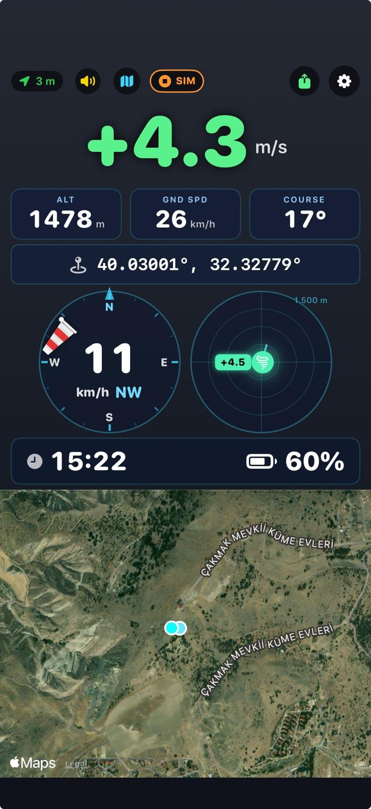
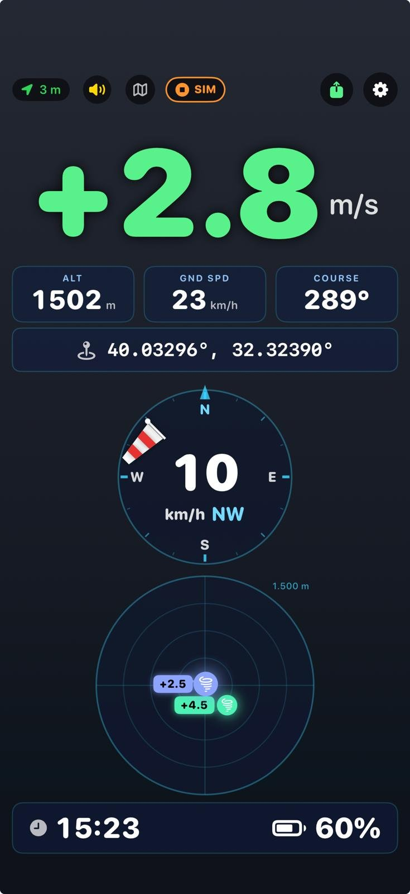
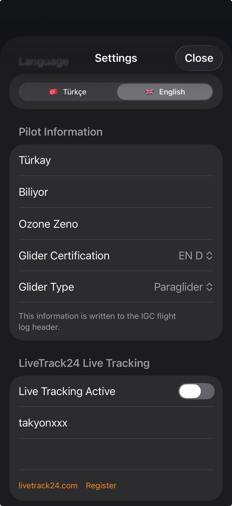

# Vario TB — iOS Paragliding Variometer

Yamaç paraşütü ve planör pilotları için SwiftUI ile yazılmış, **serbest pixel konumlandırmalı özelleştirilebilir panel** odaklı variometer uygulaması. Türkçe/İngilizce arayüz, uydu haritası, barometrik vario, rüzgâr hesabı, termik radarı, **FAI üçgen tespiti**, **XCTrack-uyumlu yarışma görevleri (QR + deep link)**, IGC uçuş kaydı, LiveTrack24 canlı takip ve Siri Shortcuts içerir.

**Hedef cihaz:** iPhone 15/16 Pro (iOS 17+) — barometre ve yüksek-hassasiyetli GPS gerekir.

---

## Ekran Görüntüleri

<p align="center">
  
  &nbsp;
  
  &nbsp;
  
  &nbsp;
  
</p>

<p align="center">
  <i>1. <b>Yarışma layout</b> — vario (sol üst), HEDEF oku (sağ üst), yer hızı/rakım, sonraki TP / goal mesafesi, harita (altta) üzerinde rüzgâr kadranı + termik radarı overlay, saat/pil alt satırda.</i><br><br>
  <i>2. <b>Serbest uçuş layout</b> — büyük vario sol üst (3 satır), rakım + yer hızı sağda (1.5'ar satır), tam-ekran harita altta, wind/radar overlay. Task kartları yok.</i><br><br>
  <i>3. <b>Ayarlar</b> — ses, birim, pilot/glider, LiveTrack24, <b>Toolbar Layout</b> (sürükle-sırala + swipe-to-delete + Reset to Default).</i><br><br>
  <i>4. <b>Uçuş kayıtları</b> — <code>Documents/Flights/*.igc</code> (gerçek uçuş: mavi uçak ikonu) + <code>Documents/Waypoints/thermals_*.cup</code> (sarı pin ikonu). <b>SIM etiketli dosyalar</b> simülatör kayıtlarıdır. Dosya başına paylaş ikonu, swipe-to-delete, üstte <b>Share All / Delete All</b> toplu işlemler.</i>
</p>

---

## Özellikler

### Serbest konumlandırmalı panel

- **Pixel-tabanlı fractional layout** — her kart panelin 0-1 aralığında x/y konumu ve w/h boyutuna sahip. Eski grid sistemi yerine serbest pozisyon.
- **Uzun bas → edit mode** — kart üzerinde mavi çerçeve + silme (×) + boyutlandırma kolu belirir.
- **Free drag/resize** — kartı istediğin yere taşı, sağ alt köşeden dürterek boyutlandır.
- **Soft snap** — bırakırken kenar/komşu hizasına yakınsa otomatik hizalanır (X ekseninde ~%3, Y ekseninde ~%2 tolerans). Küçük el titremelerini absorbe eder.
- **Harita her zaman altta (zIndex: 0)** — diğer kartlar üstüne serilir. Haritayı istediğin kadar büyütebilirsin, enstrüman kartları görünür kalır.
- **Default layout'lar**:
  - **Yarışma layout** — vario + HEDEF + hız/rakım + sonraki TP / goal mesafesi + harita (wind/radar haritayla overlay'li) + saat/pil.
  - **Serbest uçuş layout** — büyük vario + rakım/hız + tam-ekran harita + wind/radar overlay + saat/pil. Task kartları yok.
- **Edit footer** — Yarışma / Serbest / Tamam butonları scroll etse bile ekranın altında sabit durur.

### Özelleştirilebilir toolbar

- **Üst çubukta gösterilecek butonlar kullanıcı tarafından sıralanır** — Ayarlar > Toolbar Layout'tan sürükle-sırala + swipe-to-delete. Yeni buton ekleme de buradan.
- **Default sıra**: Waypointler → Yarışma Görevi → Paylaş → Simülatör → Ayarlar.

### XCTrack-uyumlu yarışma görevleri

- **QR + deep link paylaşımı** — uygulamanın ürettiği QR kod `variotb://task?data=<base64>` formatında. iOS kamera taradığında **doğrudan Vario TB'yi açar**, Flyskyhy/XCTrack gibi diğer flight app'lerle çakışma yok. Harici XCTrack `xctsk://` QR'ları da açılır.
- **İki açılış yolu**:
  1. **App içi QR tarayıcı** — "Yarışma Görevi" → QR tara butonuyla kamera açılır.
  2. **iOS Camera deep link** — QR'ı iOS'un sistem kamerası okur, üst banner'dan "Vario TB'de Aç" → task editör.
- **Turnpoint tipleri** — Takeoff, SSS (Start of Speed Section), Turnpoint, ESS (End of Speed Section), Goal. Her TP için silindir yarıçapı, irtifa, ENTRY/EXIT semantiği.
- **Görev zamanlaması** — başlama saati ve deadline (UTC), UI üzerinden set/clear.
- **Optimum tangent rota** — bisector relaxation + goal-side fallback (concentric/dejenere durumlar için). Mavi çizgi haritada canlı gözükür.
- **Canlı reach detection** — pilot silindir kenarından `radius + 10m` içine girdiğinde o TP tag edilir. SSS exit gate olarak, Turn/ESS/Goal entry gate olarak davranır. Exit-then-entry — pilot bir kez dışarı çıkmadan tekrar içeri girse de reach sayılmaz (concentric lap doğru ayrışır).
- **HEDEF bearing kartı (CourseCard)** — okun yönü pilotun uçması gereken yön. Pilot SSS içindeyken bile **SSS'ten sonraki gerçek hedef TP'nin** yönünü gösterir (SSS merkezine değil — pilot çıkış öncesi doğru yönde hazırlanır).
- **Mesafe kartları**:
  - **Sonraki TP (label = TP'nin adı)** — pilotun silindir kenarına olan anlık mesafesi. Pilot içindeyse de pozitif — `|dCenter - radius|` ile sürekli uzaklık gösterimi, 0'a sıkışmıyor.
  - **Goal** — pilottan bitişe kadar kalan toplam optimum rota (per-leg sum, reach anında smooth geçiş, jump yok).
  - **Takeoff** — pilotun kalkış noktasına düz kuş uçuşu mesafesi.
- **Harita overlay** — her silindir açık mavi halka, aralarında navy tangent rota çizgileri, reached TP'ler yeşile döner.
- **Task yüklenince auto-fit** — QR tarandığı an harita auto-follow'u kapatıp tüm task'ı çerçeveler.

### Task-aware simulator

- SIM butonu task yüklüyken aktif. Pilot takeoff TP'sine **+1000m** ile ışınlanır (ör: Ayaş 1068m + 1000 = 2068m).
- **Haritaya çizilen optimum rota çizgisini birebir takip eder** — sim path'i `SatelliteMapView.optimalRoutePoints(...)` çıktısı. Harita ne gösteriyorsa sim onu uçar.
- **Düşük irtifa koruması** — 2000m altına inerse `.taskClimb` fazına geçer, 4 m/s ile termal döner, 2500m'e ulaşınca rota takibine devam eder. Goal'e kadar birkaç termik çekerek rahatça gider.
- **Reach semantikleri birebir gerçek uçuş gibi** — SSS'te dışarı çık, Turn/ESS içeri gir, Goal merkezde dur. CompetitionTask'taki reach kapısı burada da çalışır.
- **Sim stop → task progress reset** — sim bittiğinde `reachedTPIds` temizlenir, DistanceCard stale değer göstermez. Bir sonraki run temiz başlar.

### Ana uçuş panoları

- **Büyük vario göstergesi** — tırmanışta yeşil, alçalmada kırmızı, sıfır civarında beyaz.
- **Barometrik + GPS fusion** — iOS `CMAltimeter` ile basınç-tabanlı dikey hız, GPS fallback.
- **Yer hızı + rakım** — büyük turuncu rakamlar, monospaced digit.
- **Rüzgâr kadranı (WindDial)** — yatay windsock widget'ı, pole rüzgârın geldiği yönde ring kenarında. 16-nokta kompas merkez altında.
- **Termik radarı** — tespit edilen termikleri mesafe+kuvvete göre dairesel dağılımla gösterir. Menzil 1500m. Simülatör termikleri ayrı işaretli.
- **Uydu harita kartı** — MapKit Hybrid mode, offline cache. FAI üçgen / task / termikler / pilot marker overlay.
- **Koordinat pili** — DD / DMS / DM / UTM / MGRS formatları.
- **Saat + Pil kartları** — saniye dahil büyük saat, renk kodlu pil yüzdesi (yeşil ≥50 / sarı ≥20 / kırmızı).

### Yön (heading + course) kaynağı

- **Compass birincil kaynak** — iOS magnetometer. Pilot telefon durağan iken bile doğru yön okur.
- **GPS course fallback** — compass bozuksa / cihaz magnetometer'sız ise GPS'in ground-track'i kullanılır.
- **Sim çalışırken dahi compass kullanılır** — pilot telefonu fiziksel olarak döndürerek HEDEF okunu kalibre edebilir. Sim'in sentetik heading/course değerleri UI'a enjekte edilmez.
- **Low-pass smoothing** — alpha 0.15 (≈300ms time constant) + wrap-around-safe açı filtrelemesi. Ok titremez ama gerçek rotasyona hızlı tepki verir.

### FAI Üçgen Tespiti (serbest uçuş modu)

- **Canlı üçgen takibi** — her 10s'de track history'de FAI-valid en büyük üçgen aranır.
- **FAI kuralları** — min kenar / perimeter ≥ 0.28, kapanış mesafesi / perimeter ≤ 0.20.
- **Harita görseli** — 3 turnpoint polygon, kapatma oku, home marker.
- **HUD kartı** — perimeter km + bearing + closing mesafesi.
- **Task yüklüyken FAI gizli** — yarışma modunda iki katman çakışmasın diye.
- **Performans** — point thinning + O(n³) brute force + pre-computed n² distance matrix. ~50ms.

### Uçuş kaydı & paylaşım

- **IGC formatı** — FAI standardı B-record + H-record. Dosya adı: `Documents/Flights/YYYY-MM-DD_HHMMSS[_SIM].igc`. XCSoar / XCTrack / SeeYou / XContest uyumlu.
- **CUP waypoint dosyası** — SeeYou formatı, tespit edilen termikler thermal name + climb rate + timestamp ile. Dosya adı: `Documents/Waypoints/thermals_....cup`.
- **Otomatik başlatma** — GPS fix + (hız >5 km/h veya climb >1 m/s). Simülatör başlayınca sim kaydı (`_SIM` suffixli).
- **Paylaş ekranı** — tüm dosyalar listelenir. Tek tek (iOS share sheet) veya toplu "Hepsini Paylaş". Swipe-to-delete. SIM etiketli dosyalar ikon rengiyle ayrışır (bkz. ekran 4).
- **Pilot/glider bilgisi IGC header'ına yazılır** — ad, kanat marka/model, sertifika (EN A/B/C/D, CCC), tip (PG/HG/GL/PM).

### LiveTrack24 canlı takip

- **Native session-aware protokol** — `client.php` login → sessionID → `track.php` fix upload. HTTPS → HTTP fallback.
- **5 saniyede bir pozisyon** — batch upload, XCTrack benzeri veri tüketimi.
- **Keychain şifre saklama** — kullanıcı adı AppStorage, şifre iOS Keychain.
- **Session ID formülü** — XCTrack ile bire-bir.

### Waypoint kütüphanesi

- **JSON persist** — `Documents/waypoint_library.json`.
- **Manuel giriş** — isim + koordinat + opsiyonel irtifa.
- **CUP import/export** — SeeYou formatında.
- **Task editörden seçim** — kütüphaneden TP'ye doğrudan eklenir.

### Siri Shortcuts (App Intents, iOS 16+)

- 6 ses komutu: kayıt başlat/durdur, live tracking başlat/durdur, irtifa söyle, dikey hız söyle.
- Shortcuts app entegrasyonu. iPhone 15/16 Pro **Action Button**'a bağlanabilir.
- TR + EN.

### Ses motoru

- **Procedural DSP** — AVAudioSourceNode ile 4-harmonik buzzer. Base 500Hz → max 1600Hz pitch, 2.5→8Hz cadence.
- **Bluetooth auto-routing** — AVAudioSession Bluetooth-A2DP.
- **Ayarlar'dan test** — 0→5 m/s rampa.

### Dil desteği

- **Türkçe (varsayılan) + İngilizce** — ayarlarda segmented picker.
- **Singleton + `@Published`** — dil değiştiğinde tüm ekranlar anında re-render.

---

## Kurulum

```bash
git clone <bu-repo>
cd VarioTB
open VarioTB.xcodeproj
```

1. Xcode 15+ aç.
2. Target → Signing & Capabilities → **kendi Apple Developer Team'ini seç**. Bundle ID: `com.tbiliyor.VarioTB`.
3. iPhone bağla → Run (⌘R).

**Gerçek uçuş testi için fiziksel cihaz gerekir** — iOS simülatöründe GPS, barometre ve MapKit 3D yok.

### URL scheme'ler

Info.plist iki scheme claim eder:

- `variotb://task?data=<base64>` — **kendi QR formatımız**, iOS kamera tarayınca doğrudan Vario TB açılır.
- `xctsk:<payload>` / `xctsk://<payload>` — **XCTrack uyumluluğu**. Başka app'lerden gelen XCTrack QR'larını da kabul eder.

---

## Dosya yapısı

```
.
├── README.md
├── docs/screenshots/              README ekran görüntüleri
└── VarioTB/
    ├── VarioTBApp.swift               App entry + deep link handler + DeepLink.extractTaskPayload
    ├── Info.plist                     İzinler + URL schemes (variotb, xctsk)
    ├── Assets.xcassets/               App icon
    ├── Models/
    │   ├── AppSettings.swift          @AppStorage + pendingDeepLinkTaskPayload
    │   ├── PanelLayout.swift          Pixel/fractional position layout + legacy grid migration
    │   ├── CompetitionTask.swift      Task + turnpoint + optimum route + reach gate + resetProgress
    │   ├── ThermalPoint.swift         ThermalPoint + ThermalSource(.real/.simulated)
    │   ├── WaypointLibrary.swift      JSON waypoint persistence
    │   └── L10n.swift                 TR/EN çeviri + LanguagePreference singleton
    ├── Intents/
    │   └── VarioTBIntents.swift       Siri App Intents
    ├── Managers/
    │   ├── LocationManager.swift      GPS + CMAltimeter + compass + bestHeadingDeg
    │   ├── VarioManager.swift         Vario filter + termik tespit
    │   ├── WindEstimator.swift        Circling-based rüzgâr
    │   ├── FlightSimulator.swift      Task path-follower sim + thermal recovery
    │   ├── FAITriangleDetector.swift  O(n³) FAI triangle search
    │   ├── IGCRecorder.swift          FAI IGC yazar
    │   ├── WaypointExporter.swift     SeeYou CUP
    │   ├── FlightRecorder.swift       Kayıt koordinatörü
    │   ├── KeychainStore.swift        Keychain wrapper
    │   └── LiveTrack24Tracker.swift   Session-aware LT24 client
    ├── Audio/
    │   ├── AudioEngine.swift          AVAudioSourceNode DSP
    │   └── ChimePlayer.swift          Reach chime (C5-E5-G5 arpeggio)
    ├── Utils/
    │   ├── CoordConverter.swift       DMS/DM/UTM/MGRS dönüşümleri
    │   └── TaskQRCodec.swift          XCTrack v1/v2 + variotb:// wrapper
    └── Views/
        ├── ContentView.swift          ZStack + panel + deep link drain
        ├── PanelView.swift            Pixel layout renderer + drag/resize + soft snap + zIndex split
        ├── TopBar.swift               Özelleştirilebilir toolbar
        ├── SatelliteMapView.swift     MapKit + task overlay + optimum route
        ├── WindDial.swift             Yatay windsock
        ├── ThermalRadar.swift         Termik radar
        ├── CompetitionTaskView.swift  Task editörü + QR + deep link import
        ├── WaypointsView.swift        Waypoint CRUD
        ├── TurnpointEditor.swift      Tek TP edit
        ├── TaskQRCaptureView.swift    Kamera QR tarayıcı
        ├── SettingsView.swift         Ayarlar form
        ├── FilesListView.swift        IGC/CUP listesi + paylaş/sil (bkz. ekran 4)
        └── ShareSheet.swift           UIActivityViewController wrapper
```

---

## Önemli teknik notlar

**Pixel layout + back-compat.** `PanelCard` artık `x, y, w, h: CGFloat` (0-1 fraction). `Codable` decoder eski grid alanlarını (`col/row/width/height`) otomatik fraction'a çevirir — güncellerken kullanıcı layout'u kaybolmaz. Yeni layout'lar free-form; collision detection / cascade push kaldırıldı.

**Panel zIndex split.** `PanelView` iki pass render yapar: önce map kartları (zIndex 0), sonra non-map kartlar (zIndex 10). Aktif drag/resize edilen kart 100'e çıkar. Bu yüzden haritayı tüm panele yayabilirsin — diğer kartlar üstüne serilir.

**Soft snap.** Drag/resize `onEnded` içinde hedef fraction panel kenarlarına, center'a, komşu kartların kenarlarına ±%3/%2 mesafede ise otomatik o değere yapışır. Tam grid değil — kullanıcı hizayı bozsa bile ertelenmiş düzen.

**Optimum route (hibrit).** Bisector relaxation (8 iterasyon) + concentric-dejenere fallback (goal-side radial). Tip-bazlı shift: turn/ess için `radius - 30m` içeri (reach gate tolerans 10m'nin güvenli içinde), SSS için `radius + 100m` dışarı, goal için merkez. Sim ve harita aynı polyline'ı kullanır.

**Reach semantikleri.** `gpsToleranceM = 10m`. SSS pilot dışarı çıktığında tag (outward crossing). Turn/ESS/Goal pilot içeri girdiğinde tag, ama önce dışarıda görülmüş olmalı (exit-then-entry gate) — concentric lap senaryolarında doğru ayrışır.

**Direction source.** Hem `headingDeg` hem `courseDeg` compass'tan okunur. Pilot telefonu döndürünce ok anında tepki verir (durağanken bile). GPS course sadece compass yoksa/kalibre değilse fallback. Sim sırasında bile compass aktif — kullanıcı fiziksel rotasyonla kalibrasyon yapabilir.

**Deep link akışı.** `xctsk://` ve `variotb://` schemes iOS'a kaydedildi. `VarioTBApp.onOpenURL` URL'yi parse eder, warm launch'ta NotificationCenter ile, cold launch'ta `DeepLink.pendingPayload` static stash ile `ContentView`'a iletir. `ContentView` task editör sheet'ini açar, `CompetitionTaskView.onAppear` payload'u drain edip QR scan akışına sokar.

**QR format.** `generateQR` artık XCTrack v2 payload'unu `variotb://task?data=<url-safe-base64>` içine sarar. Kendi app'imiz için iOS kamera tarayınca direkt açılır. XCTrack'tan gelen plain `XCTSK:` / `XCTSKZ:` / `xctsk:` QR'ları eski kodla parse edilmeye devam eder — geri uyumlu.

**Task simulator path.** `loadTask(waypoints:routePoints:)` hem turnpoint metadata'sı hem haritadaki blue line noktalarını alır. `.taskLeg` basit bir path-follower — point'e 10m kala sıradakine geçer. Altitude 2000m altına düşünce `.taskClimb` (4 m/s termik) devreye girer, 2500m'e ulaşınca rota takibine devam eder.

**IGC örneği.** `Documents/Flights/2026-04-24_141723.igc` — gerçek uçuş. `_SIM` suffixli dosyalar simülatör kayıtları, FilesListView'da ayrı ikonla listelenir.

**Bundle ID.** `com.tbiliyor.VarioTB` — sabit.

---

## Gelecek çalışmalar

- [ ] Airspace gösterimi (TR airspace XML import)
- [ ] Türkiye takeoff/landing sites veritabanı
- [ ] Apple Watch companion
- [ ] Otomatik IGC upload (landing detection + LiveTrack24 post-flight upload)
- [ ] XContest submit entegrasyonu
- [ ] Airtribune / PWCA task formatları
- [ ] Lock Screen widget (iOS 17 Interactive Widget)

---

## Lisans & iletişim

Bu kişisel bir projedir. Pilot: [tbiliyor](https://www.livetrack24.com/user/takyonxxx) — Türkay Biliyor.

Bug raporu ve önerler: GitHub Issues.
