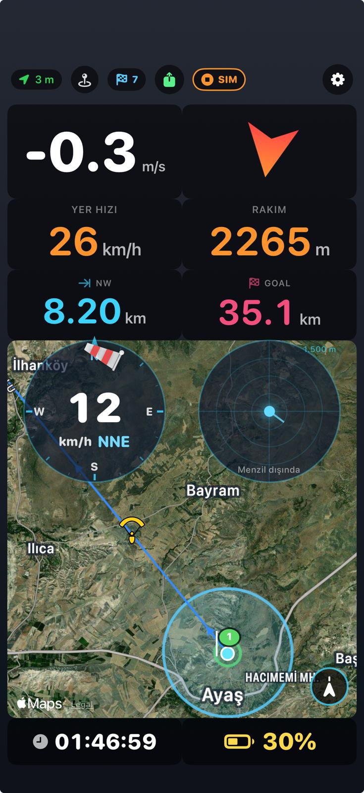
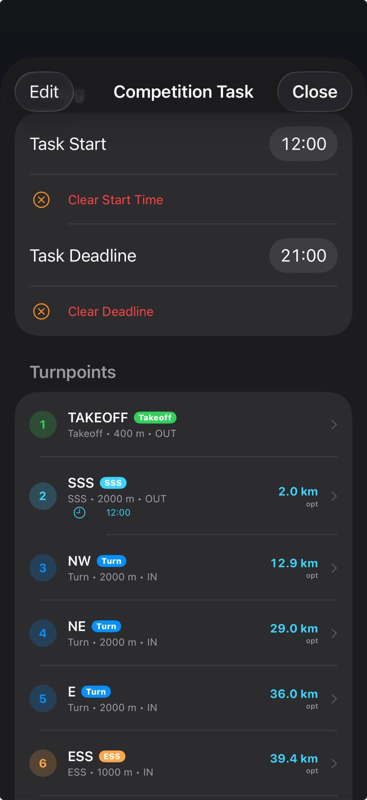
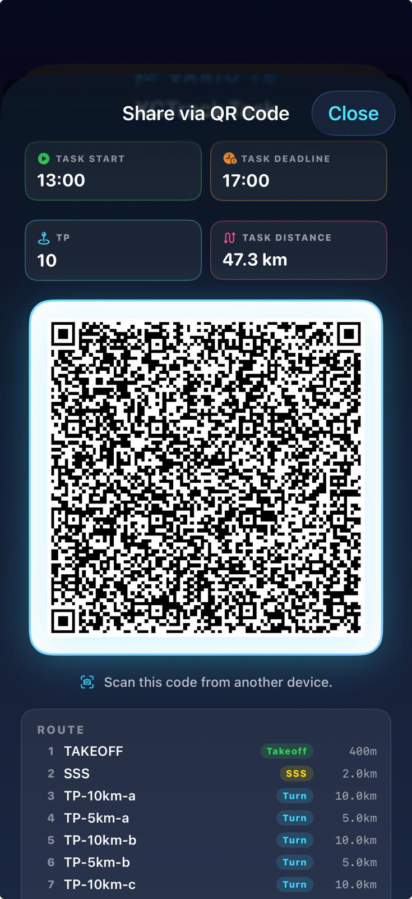
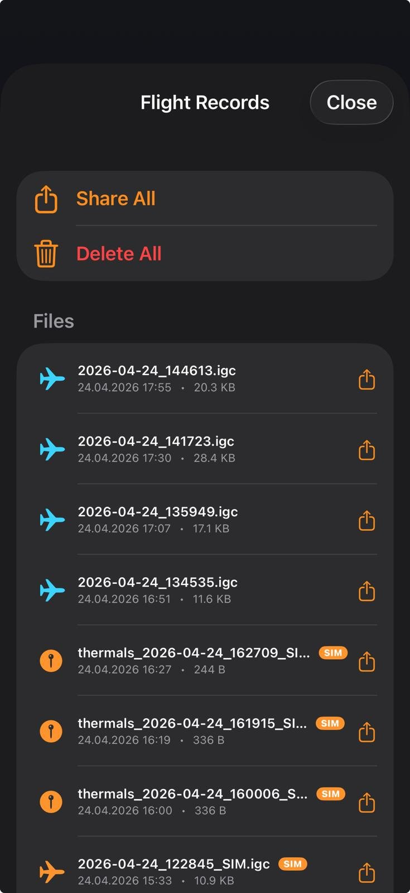
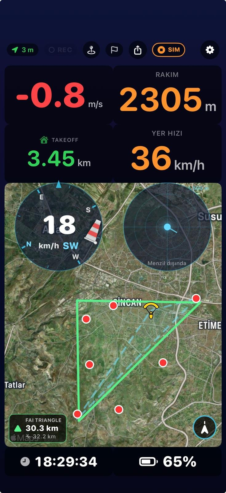
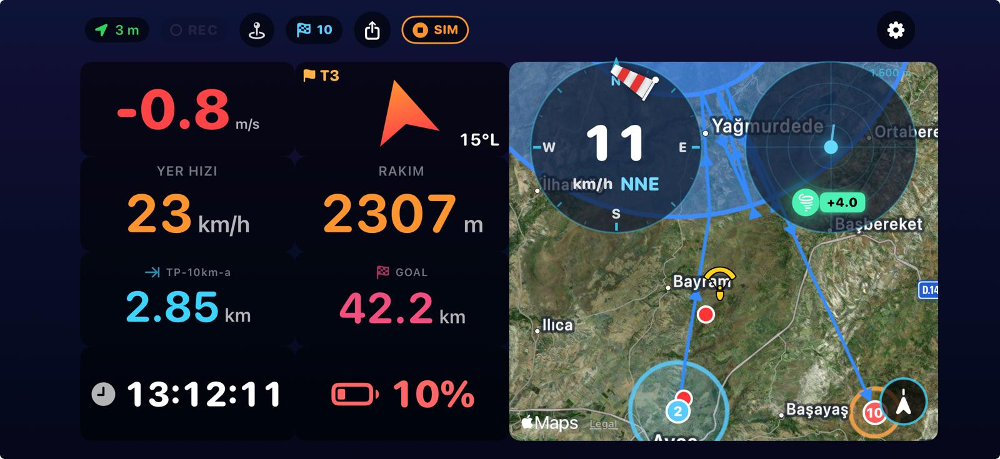

# Vario TB — iOS Paragliding Variometer

Yamaç paraşütü ve planör pilotları için SwiftUI ile yazılmış, **serbest pixel konumlandırmalı özelleştirilebilir panel** odaklı variometer uygulaması. Türkçe/İngilizce arayüz, uydu haritası, barometrik vario, **heading-up rüzgâr kadranı**, termik radarı, **canlı + FAI-validated çift katmanlı üçgen tespiti**, **XCTrack-uyumlu yarışma görevleri (QR + deep link)**, **pilot konumundan tetiklenen FAI practice simülatörü**, IGC uçuş kaydı, LiveTrack24 canlı takip ve Siri Shortcuts içerir.

**Hedef cihaz:** iPhone 15/16 Pro (iOS 17+) — barometre ve yüksek-hassasiyetli GPS gerekir.

---

## Ekran Görüntüleri

<p align="center">
  
  &nbsp;&nbsp;
  
</p>

<p align="center">
  
  &nbsp;&nbsp;
  
</p>

<p align="center">
  
</p>

<p align="center">
  
</p>

<p align="center">
  <i>1. <b>Yarışma layout</b> — vario (sol üst), HEDEF oku (sağ üst), yer hızı/rakım, sonraki TP / goal mesafesi, harita (altta) üzerinde rüzgâr kadranı + termik radarı overlay, saat/pil alt satırda.</i><br><br>
  <i>2. <b>Yarışma Görevi editörü</b> — QR tara / QR paylaş, turnpoint listesi (tip + yarıçap + kümülatif mesafe), start time / deadline, toplam optimum mesafe.</i><br><br>
  <i>3. <b>Task QR paylaşımı</b> — <code>variotb://task?data=&lt;base64&gt;</code> formatında QR kod. iOS kamera tarayınca doğrudan Vario TB'yi açar.</i><br><br>
  <i>4. <b>Uçuş kayıtları</b> — <code>Documents/Flights/*.igc</code> (gerçek uçuş: mavi uçak ikonu) + <code>Documents/Waypoints/thermals_*.cup</code> (sarı pin ikonu). <b>SIM etiketli dosyalar</b> simülatör kayıtlarıdır. Dosya başına paylaş ikonu, swipe-to-delete, üstte <b>Share All / Delete All</b> toplu işlemler.</i><br><br>
  <i>5. <b>FAI üçgen practice modu</b> — task yokken SIM butonuna basıldığında pilotun anlık GPS konumundan başlayıp 12.5 km GB → 8.75 km K → kapanış (~8.84 km, çevre ~30 km) bacaklarıyla FAI-valid bir üçgen uçar. Harita sol-altta yeşil "FAI TRIANGLE 30.3 km" pill'i + alt satırda canlı path uzunluğu (32.2 km — pilotun yere göre kat ettiği yol). Tüm bacaklar uçulduğunda ve pilot takeoff'a 6 km'den yakınsa üçgen yeşil dolu olur (kapandı).</i><br><br>
  <i>6. <b>Yatay mod</b> — telefon yatay çevrildiğinde kartlar otomatik yeniden yerleşir: tüm enstrüman okumaları sol yarıda 2'şer 2'şer satırlarda (vario + HEDEF, yer hızı + rakım, SSS + GOAL, saat + pil), harita sağ yarıda tam yükseklik (rüzgâr kadranı + termik radarı overlay).</i>
</p>

---

## Özellikler

### Serbest konumlandırmalı panel

- **Pixel-tabanlı fractional layout** — her kart panelin 0-1 aralığında x/y konumu ve w/h boyutuna sahip. Eski grid sistemi yerine serbest pozisyon.
- **Uzun bas → edit mode** — kart üzerinde mavi çerçeve + silme (×) + boyutlandırma kolu belirir.
- **Free drag/resize** — kartı istediğin yere taşı, sağ alt köşeden dürterek boyutlandır.
- **Soft snap** — bırakırken kenar/komşu hizasına yakınsa otomatik hizalanır (X ekseninde ~%3, Y ekseninde ~%2 tolerans). Küçük el titremelerini absorbe eder.
- **Harita her zaman altta (zIndex: 0)** — diğer kartlar üstüne serilir. Haritayı istediğin kadar büyütebilirsin, enstrüman kartları görünür kalır.
- **Default layout'lar**:
  - **Yarışma layout** — vario + HEDEF + hız/rakım + sonraki TP / goal mesafesi + harita (wind/radar haritayla overlay'li) + saat/pil.
  - **Serbest uçuş layout** — büyük vario + rakım/hız + tam-ekran harita + wind/radar overlay + saat/pil. Task kartları yok.
- **Edit footer** — Yarışma / Serbest / Tamam butonları scroll etse bile ekranın altında sabit durur.

### Özelleştirilebilir toolbar

- **Üst çubukta gösterilecek butonlar kullanıcı tarafından sıralanır** — Ayarlar > Toolbar Layout'tan sürükle-sırala + swipe-to-delete. Yeni buton ekleme de buradan.
- **Default sıra**: Waypointler → Yarışma Görevi → Paylaş → Simülatör → Ayarlar.

### XCTrack-uyumlu yarışma görevleri

- **QR + deep link paylaşımı** — uygulamanın ürettiği QR kod `variotb://task?data=<base64>` formatında. iOS kamera taradığında **doğrudan Vario TB'yi açar**, Flyskyhy/XCTrack gibi diğer flight app'lerle çakışma yok. Harici XCTrack `xctsk://` QR'ları **app içi QR tarayıcıdan** parse edilir — iOS Camera'dan değil, çünkü `xctsk:` schema'sı Flyskyhy'a bırakılmıştır (detay aşağıda URL scheme'ler bölümünde).
- **İki açılış yolu**:
  1. **App içi QR tarayıcı** — "Yarışma Görevi" → QR tara butonuyla kamera açılır.
  2. **iOS Camera deep link** — QR'ı iOS'un sistem kamerası okur, üst banner'dan "Vario TB'de Aç" → task editör.
- **Turnpoint tipleri** — Takeoff, SSS (Start of Speed Section), Turnpoint, ESS (End of Speed Section), Goal. Her TP için silindir yarıçapı, irtifa, ENTRY/EXIT semantiği.
- **Görev zamanlaması** — başlama saati ve deadline (UTC), UI üzerinden set/clear.
- **Optimum tangent rota** — bisector relaxation + goal-side fallback (concentric/dejenere durumlar için). Mavi çizgi haritada canlı gözükür.
- **Canlı reach detection** — pilot silindir kenarından `radius + 10m` içine girdiğinde o TP tag edilir. SSS exit gate olarak, Turn/ESS/Goal entry gate olarak davranır. Exit-then-entry — pilot bir kez dışarı çıkmadan tekrar içeri girse de reach sayılmaz (concentric lap doğru ayrışır).
- **HEDEF bearing kartı (CourseCard)** — okun yönü pilotun uçması gereken yön. Pilot SSS içindeyken bile **SSS'ten sonraki gerçek hedef TP'nin** yönünü gösterir (SSS merkezine değil — pilot çıkış öncesi doğru yönde hazırlanır).
- **Mesafe kartları**:
  - **Sonraki TP (label = TP'nin adı)** — pilotun silindir kenarına olan anlık mesafesi. Pilot içindeyse de pozitif — `|dCenter - radius|` ile sürekli uzaklık gösterimi, 0'a sıkışmıyor.
  - **Goal** — pilottan bitişe kadar kalan toplam optimum rota (per-leg sum, reach anında smooth geçiş, jump yok).
  - **Takeoff** — pilotun kalkış noktasına düz kuş uçuşu mesafesi.
- **Harita overlay** — her silindir açık mavi halka, aralarında navy tangent rota çizgileri, reached TP'ler yeşile döner.
- **Task yüklenince auto-fit** — QR tarandığı an harita auto-follow'u kapatıp tüm task'ı çerçeveler.

### İki-modlu simulator

SIM butonu task yüklü olup olmamasına göre iki farklı şekilde çalışır:

**Task yüklüyken — yarışma simülatörü:**
- Pilot takeoff TP'sine **+1000m** ile ışınlanır (ör: Ayaş 1068m + 1000 = 2068m).
- **Haritaya çizilen optimum rota çizgisini birebir takip eder** — sim path'i `SatelliteMapView.optimalRoutePoints(...)` çıktısı. Harita ne gösteriyorsa sim onu uçar.
- **Düşük irtifa koruması** — 2000m altına inerse `.taskClimb` fazına geçer, 4 m/s ile termal döner, 2500m'e ulaşınca rota takibine devam eder. Goal'e kadar birkaç termik çekerek rahatça gider.
- **Reach semantikleri birebir gerçek uçuş gibi** — SSS'te dışarı çık, Turn/ESS içeri gir, Goal merkezde dur. CompetitionTask'taki reach kapısı burada da çalışır.

**Task yokken — FAI üçgen practice:**
- Pilotun anlık GPS konumundan başlayan ~30 km'lik FAI-valid üçgen uçulur (geometri detayları FAI bölümünde).
- FAI detector + provisional/validated overlay'ler test edilir, pilot bir görev planlamadan da bütün canlı tespit pipeline'ını çalışır halde görür.
- GPS fix yoksa SIM butonu kapalı kalır (üçgenin merkezini sabitleyecek nokta yok).

**Ortak davranışlar:**
- **Sim stop → reset** — `reachedTPIds` temizlenir, FAI detector durur (state ekranda kalır), DistanceCard stale değer göstermez. Bir sonraki run temiz başlar.
- **FAI detector lifecycle** — recorder VEYA simulator aktifse detector çalışır (rising edge'de start, ikisi de durunca stop). Sim sırasında IGC dosyası yazılmaz, ama in-memory FAI tespiti tam olarak çalışır.

### Ana uçuş panoları

- **Büyük vario göstergesi** — tırmanışta yeşil, alçalmada kırmızı, sıfır civarında beyaz.
- **Barometrik + GPS fusion** — iOS `CMAltimeter` ile basınç-tabanlı dikey hız, GPS fallback.
- **Yer hızı + rakım** — büyük turuncu rakamlar, monospaced digit.
- **Rüzgâr kadranı (WindDial) — heading-up** — kart üstü daima pilotun gidiş yönü. Tüm "world" katmanı (16-tick ring, N/E/S/W harfleri, windsock) `-courseDeg` ile döner; harflerin glyph'i karşı yönde counter-rotate edilir, böylece "N" gibi pozisyon değişse bile yan yatmaz. Windsock direği rüzgârın geldiği yönü **pilota göre** gösterir (üstte → karşıdan, altta → arkadan, sol/sağ → yan rüzgar). Cyan üçgen pilot işaretçisi tepede sabit. Merkez sayısal değer rüzgar hızı (km/h) + mutlak compass yön (radyo iletişimi için).
- **Termik radarı** — tespit edilen termikleri mesafe+kuvvete göre dairesel dağılımla gösterir. Menzil 1500m. Simülatör termikleri ayrı işaretli.
- **Uydu harita kartı** — MapKit Hybrid mode, offline cache. FAI üçgen / task / termikler / pilot marker overlay.
- **Koordinat pili** — DD / DMS / DM / UTM / MGRS formatları.
- **Saat + Pil kartları** — saniye dahil büyük saat, renk kodlu pil yüzdesi (yeşil ≥50 / sarı ≥20 / kırmızı).

### Yön (heading + course) kaynağı

- **GPS course-over-ground birincil kaynak** — pilotun gerçekten *gittiği* yön, telefonun nereye baktığı değil. XCTrack, Skytraxx, Naviter Oudie ve diğer sertifikalı yamaç paraşütü aletleriyle aynı yaklaşım. Telefon harness'a yan tutulsa, cebe ters konsa bile doğru sonuç verir; rüzgar drift'i altında "glider burnu kuzeyde ama hareket KB'de" gibi durumlarda navigasyon yine doğru.
- **Manyetik compass fallback** — pilot hızı 1.0 m/s altında (yerde duruyor / hazırlanıyor / çok yavaş termik) ise GPS course gürültülü kalır, o zaman magnetometer devreye girer. Compass ≤30° accuracy gate'iyle filtrelenir.
- **Sim modunda compass zorlanır** — sim sahte yüksek hız üretir, GPS doğal olarak baskın olurdu; bu test özelliğini korumak için sim aktifken compass kullanılır. Pilot telefonu fiziksel olarak çevirip dial/HEDEF'in doğru çalıştığını doğrulayabilir.
- **Heading kartları**:
  - **HEDEF (CourseCard)** — task yokken north-up pusula (üstte = pilotun gidiş yönü, ok yine gidişe işaret eder), task varsa heading-up modunda next TP'nin pilota göreli yönünü gösterir. Sayısal R/L: "60°R" = 60° sağa dön, "0°" = doğrudan hedefe.
  - **Yön (Gerçek) — TrueHeadingCard** — daima ham GPS course'u north-up gösterir. Üst-orta sabit cyan "N" işaretçisi, sağ-altta sayısal değer (örn. "245°"). Pilot bunu CourseCard'la yan yana koyarsa hem mutlak yön hem hedef sapması okuyabilir.
- **Wrap-around-safe rotation** — tüm dial'lar (heading kartları + WindDial) 359°→1° geçişinde kısa-yol unwrap ile dönüyor. Tam tur "spin" yok, ok kararlı.
- **LiveTrack24 COG** — online tracking'e gönderilen Course Over Ground değeri saf GPS track. Compass değeri tracking servisine gitmez (protokol gereği COG = ground track).

### FAI üçgen tespiti — çift katmanlı (serbest uçuş modu)

Klasik "uçuş sonu skor hesabı" yerine **canlı görsel geri bildirim**: pilot uçtukça iki ayrı üçgen kavramı çizilir.

- **Provisional ("şu an ne uçuyorum") — cyan kesikli, daima canlı**
  - 3 köşe: takeoff + uçuşun en uzak noktası + pilotun anlık konumu.
  - FAI 28% kuralından bağımsız — sadece geometriyi gösterir.
  - Pilotun konumu canlı tracker olduğu için üçgenin 3. köşesi her fix'te kayar.
  - **Görsel kapılar** (görünmek için ikisi de geçilmeli):
    - Min kenar ≥ 500 m: çok küçük "üçgenler" pilot ikonu altındaki blob olarak görünmez.
    - Outer noktada iç açı ≤ 150°: pilot keskin bir dönüş yapmadan üçgen ortaya çıkmaz. Düz hatta uçuş sırasında 3 nokta bir doğru üzerinde olur (açı ≈ 180°), bu durumda gizlenir.
- **Validated ("FAI valid") — amber kesikli (açık) → yeşil dolu (kapalı)**
  - Brute-force her 10 saniyede bir keypoint buffer'ından FAI 28% min-kenar/perimetre oranını geçen en büyük üçgeni arar.
  - **Açık** (closing > %20 perimetre): amber kesikli + pilottan takeoff'a yeşil kapanış oku.
  - **Kapalı** (closing ≤ %20): yeşil dolu, kapanış oku kaybolur, üçgen "skor" olarak donar.
- **Renk ayrımı** — provisional cyan, validated amber/yeşil. İki katman aynı anda haritadayken renkleri karışmaz.
- **Harita sol-altta pill kartı**:
  - Üst etiket: "TAHMİNİ" (henüz FAI valid değil) ya da "FAI ÜÇGENİ" (validated).
  - Büyük: üçgen perimetresi (validTriangle yoksa provisional'ın).
  - Küçük altında: pilotun kat ettiği gerçek uçuş yolu (rüzgar drift, termik döngüleri ve TP'ler arasında uçtuğu tüm yer mesafesi dahil). Rüzgar etkisi + termal döngüleri sayesinde perimetreden büyük olabilir.
- **Performans** — keyPoint thinning (≥200m spacing, ≤150 nokta) + O(n³) brute force + pre-computed n² distance matrix. ~50ms iPhone'da. Provisional ise O(1) / fix.
- **Task yüklüyken FAI gizli** — yarışma modunda iki katman çakışmasın diye.

### FAI practice simülatörü

Task yüklü değilken SIM butonu artık "kuru kuru no-op" değil — pilotun **anlık GPS konumundan** başlayan bir FAI-valid practice üçgeni uçar.

- **Geometri**: TP1 = takeoff'tan 12.50 km @ 225° (GB), TP2 = TP1'den 8.75 km @ 0° (K), kapanış ~8.84 km. Toplam çevre ~30.09 km, min-kenar/perimetre 0.291 (FAI 0.28 eşiğinin üstünde, marjlı).
- **Bacak uzunlukları neden eşitsiz?** Üçgen şekli FAI ratio'yu belirler — boyutu büyütmek tek başına yetmez. 10/10/~7.65 km geometri 0.277 ile eşiğin altında kalırdı. Bacak 1 ve 2'yi farklı tutmak şekli yeniden ölçeklendirir, sonra hepsi 30 km perimetreye sığacak şekilde büyütülür.
- **Akış**: pilot konumundan +1000 m yukarı ışınlanır → GB'ye 12.5 km uçar → 60°/s termal dönüşüyle 2500 m'e tırmanır → kuzeye 8.75 km uçar → tekrar termal → kapanış bacağı → takeoff'a iniş.
- **Tüm overlay'ler aktif**: provisional cyan üçgen pilot uçtukça büyür, takeoff+TP1+TP2 keypoints biriktiğinde brute-force 30 km validated triangle'ı kazanır (amber). Pilot dönüşte takeoff'a 6 km'den yakına gelince yeşile döner.
- **IGC kaydı yapılmaz** — sahte uçuş gerçek dosya sistemine karışmasın diye. Detector ise belleğe çalışır.

### Uçuş kaydı & paylaşım

- **IGC formatı** — FAI standardı B-record + H-record. Dosya adı: `Documents/Flights/YYYY-MM-DD_HHMMSS[_SIM].igc`. XCSoar / XCTrack / SeeYou / XContest uyumlu.
- **CUP waypoint dosyası** — SeeYou formatı, tespit edilen termikler thermal name + climb rate + timestamp ile. Dosya adı: `Documents/Waypoints/thermals_....cup`.
- **Otomatik başlatma** — GPS fix + (hız >5 km/h veya climb >1 m/s). Simülatör başlayınca sim kaydı (`_SIM` suffixli).
- **Paylaş ekranı** — tüm dosyalar listelenir. Tek tek (iOS share sheet) veya toplu "Hepsini Paylaş". Swipe-to-delete. SIM etiketli dosyalar ikon rengiyle ayrışır (bkz. ekran 4).
- **Pilot/glider bilgisi IGC header'ına yazılır** — ad, kanat marka/model, sertifika (EN A/B/C/D, CCC), tip (PG/HG/GL/PM).

### LiveTrack24 canlı takip

- **Native session-aware protokol** — `client.php` login → sessionID → `track.php` fix upload. HTTPS → HTTP fallback.
- **5 saniyede bir pozisyon** — batch upload, XCTrack benzeri veri tüketimi.
- **Keychain şifre saklama** — kullanıcı adı AppStorage, şifre iOS Keychain.
- **Session ID formülü** — XCTrack ile bire-bir.

### Waypoint kütüphanesi

- **JSON persist** — `Documents/waypoint_library.json`.
- **Manuel giriş** — isim + koordinat + opsiyonel irtifa.
- **CUP import/export** — SeeYou formatında.
- **Task editörden seçim** — kütüphaneden TP'ye doğrudan eklenir.

### Siri Shortcuts (App Intents, iOS 16+)

- 6 ses komutu: kayıt başlat/durdur, live tracking başlat/durdur, irtifa söyle, dikey hız söyle.
- Shortcuts app entegrasyonu. iPhone 15/16 Pro **Action Button**'a bağlanabilir.
- TR + EN.

### Ses motoru

- **Procedural DSP** — AVAudioSourceNode ile 4-harmonik buzzer. Base 500Hz → max 1600Hz pitch, 2.5→8Hz cadence.
- **Bluetooth auto-routing** — AVAudioSession Bluetooth-A2DP.
- **Ayarlar'dan test** — 0→5 m/s rampa.

### Dil desteği

- **Türkçe (varsayılan) + İngilizce** — ayarlarda segmented picker.
- **Singleton + `@Published`** — dil değiştiğinde tüm ekranlar anında re-render.

---

## Kurulum

```bash
git clone <bu-repo>
cd VarioTB
open VarioTB.xcodeproj
```

1. Xcode 15+ aç.
2. Target → Signing & Capabilities → **kendi Apple Developer Team'ini seç**. Bundle ID: `com.tbiliyor.VarioTB`.
3. iPhone bağla → Run (⌘R).

**Gerçek uçuş testi için fiziksel cihaz gerekir** — iOS simülatöründe GPS, barometre ve MapKit 3D yok.

### URL scheme'ler

Info.plist tek bir scheme claim eder:

- `variotb://task?data=<base64>` — **kendi QR formatımız**, iOS kamera tarayınca doğrudan Vario TB açılır. Hiçbir başka uçuş app'i bu schema'yı kullanmaz, çakışma yok.

**`xctsk:` schema'sı bilinçli olarak claim edilmemiştir.** XCTrack ve Flyskyhy bu schema'yı zaten claim ediyor; biz de claim etseydik iOS hangi app'in açılacağını seçemediğinden (kullanıcıya seçenek sunmadan en son kurulan app'i kullanır) kullanıcıların **alıştığı Flyskyhy davranışı bozulur**, beklenmedik biçimde Vario TB açılırdı. Pilot xctsk QR'larını yine tarayabilir — **app içi QR tarayıcı** (Yarışma Görevi → QR Tara) doğrudan kameraya bağlanır ve `xctsk:` payload'larını parse eder, iOS deep-link resolver'ına dokunmadan. Ya da pilot Vario TB'den QR oluşturduğunda biz `variotb://` formatını kullandığımız için iOS Camera onu kesin olarak Vario TB'de açar.

---

## Dosya yapısı

```
.
├── README.md
├── docs/screenshots/              README ekran görüntüleri
└── VarioTB/
    ├── VarioTBApp.swift               App entry + deep link handler + DeepLink.extractTaskPayload
    ├── Info.plist                     İzinler + URL scheme (variotb — xctsk Flyskyhy'a bırakıldı)
    ├── Assets.xcassets/               App icon
    ├── Models/
    │   ├── AppSettings.swift          @AppStorage + pendingDeepLinkTaskPayload
    │   ├── PanelLayout.swift          Pixel/fractional position layout + legacy grid migration
    │   ├── CompetitionTask.swift      Task + turnpoint + optimum route + reach gate + resetProgress
    │   ├── ThermalPoint.swift         ThermalPoint + ThermalSource(.real/.simulated)
    │   ├── WaypointLibrary.swift      JSON waypoint persistence
    │   └── L10n.swift                 TR/EN çeviri + LanguagePreference singleton
    ├── Intents/
    │   └── VarioTBIntents.swift       Siri App Intents
    ├── Managers/
    │   ├── LocationManager.swift      GPS + CMAltimeter + compass + GPS-öncelikli bestHeadingDeg
    │   ├── VarioManager.swift         Vario filter + termik tespit
    │   ├── WindEstimator.swift        Circling-based rüzgâr
    │   ├── FlightSimulator.swift      İki-modlu sim: task path-follower + FAI triangle practice + thermal recovery
    │   ├── FAITriangleDetector.swift  Provisional (canlı, FAI bağımsız) + validated (O(n³) FAI-uyumlu) çift triangle + path length
    │   ├── IGCRecorder.swift          FAI IGC yazar
    │   ├── WaypointExporter.swift     SeeYou CUP
    │   ├── FlightRecorder.swift       Kayıt koordinatörü
    │   ├── KeychainStore.swift        Keychain wrapper
    │   └── LiveTrack24Tracker.swift   Session-aware LT24 client
    ├── Audio/
    │   ├── AudioEngine.swift          AVAudioSourceNode DSP
    │   └── ChimePlayer.swift          Reach chime (C5-E5-G5 arpeggio)
    ├── Utils/
    │   ├── CoordConverter.swift       DMS/DM/UTM/MGRS dönüşümleri
    │   └── TaskQRCodec.swift          XCTrack v1/v2 + variotb:// wrapper
    └── Views/
        ├── ContentView.swift          ZStack + panel + deep link drain
        ├── PanelView.swift            Pixel layout renderer + drag/resize + soft snap + zIndex split
        ├── TopBar.swift               Özelleştirilebilir toolbar
        ├── SatelliteMapView.swift     MapKit + task overlay + optimum route + dual FAI triangle (provisional + validated)
        ├── WindDial.swift             Heading-up windsock dial (counter-rotated cardinals)
        ├── ThermalRadar.swift         Termik radar
        ├── CompetitionTaskView.swift  Task editörü + QR + deep link import
        ├── WaypointsView.swift        Waypoint CRUD
        ├── TurnpointEditor.swift      Tek TP edit
        ├── TaskQRCaptureView.swift    Kamera QR tarayıcı
        ├── SettingsView.swift         Ayarlar form
        ├── FilesListView.swift        IGC/CUP listesi + paylaş/sil (bkz. ekran 4)
        └── ShareSheet.swift           UIActivityViewController wrapper
```

---

## Önemli teknik notlar

**Pixel layout + back-compat.** `PanelCard` artık `x, y, w, h: CGFloat` (0-1 fraction). `Codable` decoder eski grid alanlarını (`col/row/width/height`) otomatik fraction'a çevirir — güncellerken kullanıcı layout'u kaybolmaz. Yeni layout'lar free-form; collision detection / cascade push kaldırıldı.

**Panel zIndex split.** `PanelView` iki pass render yapar: önce map kartları (zIndex 0), sonra non-map kartlar (zIndex 10). Aktif drag/resize edilen kart 100'e çıkar. Bu yüzden haritayı tüm panele yayabilirsin — diğer kartlar üstüne serilir.

**Soft snap.** Drag/resize `onEnded` içinde hedef fraction panel kenarlarına, center'a, komşu kartların kenarlarına ±%3/%2 mesafede ise otomatik o değere yapışır. Tam grid değil — kullanıcı hizayı bozsa bile ertelenmiş düzen.

**Optimum route (hibrit).** Bisector relaxation (8 iterasyon) + concentric-dejenere fallback (goal-side radial). Tip-bazlı shift: turn/ess için `radius - 30m` içeri (reach gate tolerans 10m'nin güvenli içinde), SSS için `radius + 100m` dışarı, goal için merkez. Sim ve harita aynı polyline'ı kullanır.

**Reach semantikleri.** `gpsToleranceM = 10m`. SSS pilot dışarı çıktığında tag (outward crossing). Turn/ESS/Goal pilot içeri girdiğinde tag, ama önce dışarıda görülmüş olmalı (exit-then-entry gate) — concentric lap senaryolarında doğru ayrışır.

**Direction source.** GPS course-over-ground birincil; pilot hızı 1.0 m/s altındaysa ve compass kalibre ise (`headingAccuracyDeg ≤ 30`) magnetometer'a düşer. Sim aktifken compass zorlanır (test özelliği). `gpsCourseDeg` her durumda raw GPS track'i tutar — WindEstimator dairesel termal hareketi buradan okur. `bestHeadingDeg` UI selector — heading kartları ve harita pilot ikonu bunu kullanır. LiveTrack24 COG ise `gpsCourseDeg`'i gönderir, asla compass'ı.

**FAI tespiti çift katmanlı.** `FAITriangleDetector` iki published triangle yayar:
- `provisionalTriangle` — `recordFix` her çağrıldığında (her tick) güncellenir. takeoff + en uzak keypoint + currentCoord. O(1) güncelleme, pilot konumu ile canlı kayar. İki gate (min kenar 500 m + outer iç açı ≤ 150°) düz uçuş ve degenerate durumları suppress eder.
- `validTriangle` — `recompute()` 10 saniyede bir. Brute-force O(n³) keyPoints'ten 28% min-kenar kuralını geçen en büyük üçgeni seçer. `flightStart`/`currentCoord` arası closing distance perimetrenin %20'sinden küçükse `isClosed = true`.
- Buna ek olarak `pathLengthM` her ardışık raw fix arasındaki haversine mesafesini biriktirir — pilotun yere göre kat ettiği gerçek yol. Pill'de "küçük ikinci sayı" olarak gösterilir.

**Detector lifecycle.** `recorder.isRecording || simulator.isRunning` bileşik durumu üzerinden yönetilir. Rising edge'de `fai.start()` (tüm state'i sıfırlar), falling edge'de `fai.stop()` (timer'ı durdurur, state ekranda kalır). Recorder ve simulator iki ayrı `onChange` ile aynı `updateFAILifecycle()` helper'ını çağırır — peş peşe start çağrılmaz, mid-flight reset olmaz.

**WindDial heading-up.** Tüm dial dünyası `-courseDeg` ile döner; cardinal harfler her biri `+courseDeg` counter-rotate ile glyph dik tutulur. Windsock dial içinde `windFromDeg` ile döner, bileşik rotasyon pilota göreli rüzgar pozisyonu verir. AngleUnwrap ile 350°→10° geçişlerinde tam tur dönüş engellenir.

**Deep link akışı.** Sadece `variotb://` schema'sı iOS'a kaydedildi. `VarioTBApp.onOpenURL` URL'yi parse eder, warm launch'ta NotificationCenter ile, cold launch'ta `DeepLink.pendingPayload` static stash ile `ContentView`'a iletir. `ContentView` task editör sheet'ini açar, `CompetitionTaskView.onAppear` payload'u drain edip QR scan akışına sokar. `xctsk:` URL'leri iOS Camera tarafından artık Vario TB'ye yönlendirilmez (Flyskyhy önceliği), ama kod içinde `xctsk:` parser hâlâ vardır — app içi QR tarayıcı (kamera) `xctsk:` payload'larını yakalar ve aynı pipeline'a sokar.

**QR format.** `generateQR` artık XCTrack v2 payload'unu `variotb://task?data=<url-safe-base64>` içine sarar. Kendi app'imiz için iOS kamera tarayınca direkt açılır. XCTrack'tan gelen plain `XCTSK:` / `XCTSKZ:` / `xctsk:` QR'ları eski kodla parse edilmeye devam eder — geri uyumlu.

**Simulator routing.** İki tetikleyici: task yüklü ise `loadTask(waypoints:routePoints:)` (haritadaki blue line noktalarını alır), task yoksa `loadFAITrianglePractice(from:pilotAltM:)` (pilot konumundan 4-noktalı üçgen route üretir, `destination(from:bearingDeg:distanceKm:)` great-circle helper'ı ile). Her iki yol da `taskWaypoints`'i doldurur, sonra `start()` aynı path-follower'ı çalıştırır. `.taskLeg` basit bir path-follower — point'e 10m kala sıradakine geçer. Altitude 2000m altına düşünce `.taskClimb` (4 m/s termik) devreye girer, 2500m'e ulaşınca rota takibine devam eder.

**IGC örneği.** `Documents/Flights/2026-04-24_141723.igc` — gerçek uçuş. `_SIM` suffixli dosyalar simülatör kayıtları, FilesListView'da ayrı ikonla listelenir.

**Bundle ID.** `com.tbiliyor.VarioTB` — sabit.

---

## Gelecek çalışmalar

- [ ] Airspace gösterimi (TR airspace XML import)
- [ ] Türkiye takeoff/landing sites veritabanı
- [ ] Apple Watch companion
- [ ] Otomatik IGC upload (landing detection + LiveTrack24 post-flight upload)
- [ ] XContest submit entegrasyonu
- [ ] Airtribune / PWCA task formatları
- [ ] Lock Screen widget (iOS 17 Interactive Widget)

---

## Lisans & iletişim

Bu kişisel bir projedir. Pilot: [tbiliyor](https://www.livetrack24.com/user/takyonxxx) — Türkay Biliyor.

Bug raporu ve önerler: GitHub Issues.
